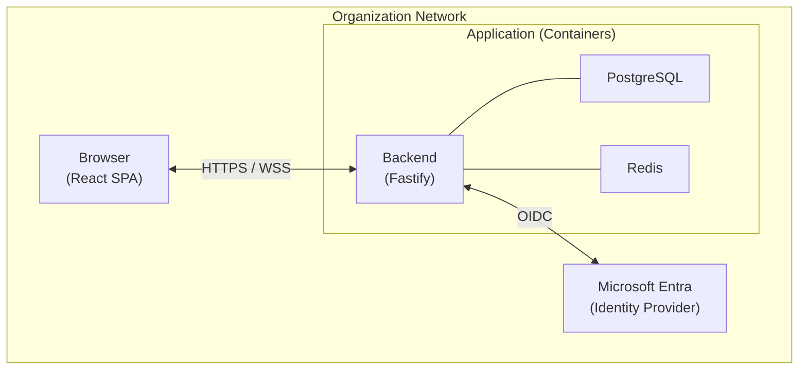
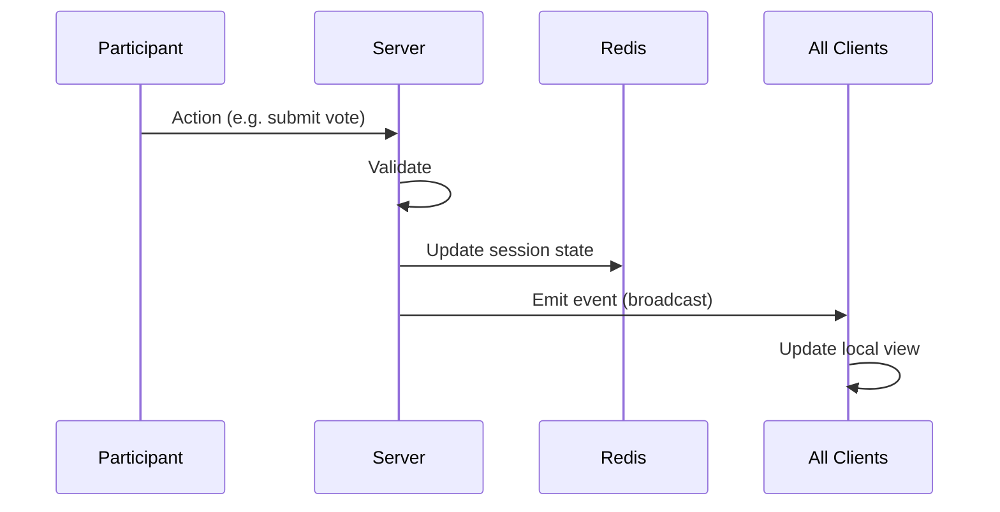
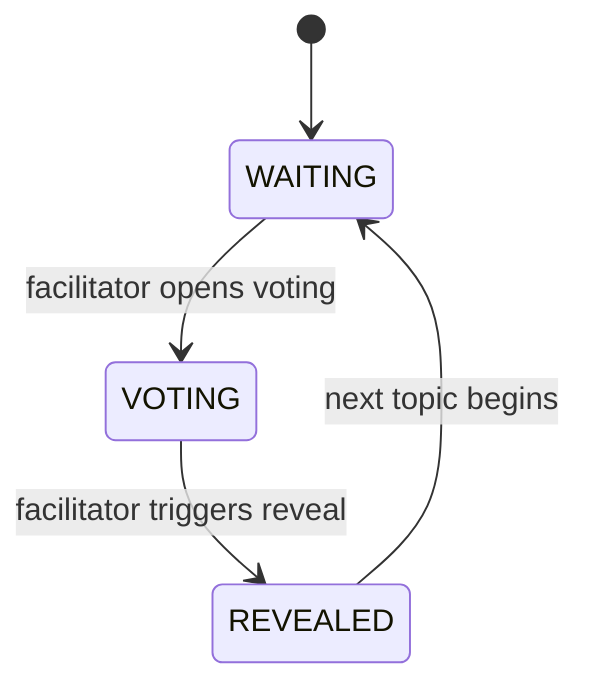

# Engineering Health Check — High-Level Architecture

|                        |                                                                   |
|------------------------|-------------------------------------------------------------------|
| **Document Date**      | 2026-03-07                                                        |
| **Version**            | 0.1 — Draft for Review                                            |
| **Status**             | Working Draft — Not Yet Approved                                  |
| **Authors**            | Marcus Delgado (BA), Ingrid Sollenberger (Solution Architect), Tomás Ferreira (Security Analyst), Marcus Oyelaran (Full Stack Engineer) |
| **Review Milestone**   | Pre-implementation architecture checkpoint                        |

---

## How to Read This Document

This document was produced collaboratively by four contributors with distinct responsibilities. Where a decision reflects one contributor's primary domain, that is noted. Where decisions represent genuine collaboration or unresolved tension between perspectives, that is noted too.

Section ownership is indicated at the start of each section. **Review Notes** call out specific concerns or constraints raised by individual contributors that the implementation team must not lose.

---

## Table of Contents

1. [Purpose and Scope](#1-purpose-and-scope)
2. [System Context](#2-system-context)
3. [Functional Architecture](#3-functional-architecture)
4. [Component Architecture](#4-component-architecture)
5. [Data Architecture](#5-data-architecture)
6. [Authentication and Authorization Architecture](#6-authentication-and-authorization-architecture)
7. [Real-Time Architecture](#7-real-time-architecture)
8. [Security Architecture](#8-security-architecture)
9. [Deployment Architecture](#9-deployment-architecture)
10. [Observability](#10-observability)
11. [Architectural Decisions Record](#11-architectural-decisions-record)
12. [Open Questions](#12-open-questions)

---

## 1. Purpose and Scope

*Primary author: Marcus Delgado (Business Analyst)*

### 1.1 What This Document Describes

This document describes the high-level architecture of the Engineering Health Check web application — the system that replaces the existing spreadsheet-based Engineering Health Check ritual. It covers the application's structure, component responsibilities, data model, authentication model, real-time behavior, security posture, and deployment configuration.

It is not a detailed design document. It does not specify database schemas, API contracts, or UI wireframes. Those are covered in companion documents. This document describes how the system is organized, what each part is responsible for, and what the significant architectural decisions are and why they were made.

### 1.2 What the Application Does

The Engineering Health Check is a facilitated ritual in which an engineering team votes on the health of their work across a set of topic areas (production code, test suite, pipeline, technology stack, pairing). The ritual's integrity depends on simultaneous vote revelation — no participant can see how others voted before the facilitator triggers the reveal.

The application automates and replaces the spreadsheet used to run this ritual. It provides:

- A live, real-time session room for facilitators and participants
- A simultaneous vote reveal enforced by the server, not by trust
- Automatic outlier detection after each reveal
- Action item tracking across sessions
- Historical trend visibility per team and per topic
- Delegated authentication through the organization's existing identity provider

### 1.3 What Is Out of Scope

The following are explicitly out of scope for this application:

- Notifications or session invitations (the facilitator distributes join links manually)
- Admin role management (any authenticated user can create a team)
- Customer-facing or multi-tenant functionality (single organization, multiple teams)
- Real-time communication between participants (all communication flows through the server)

---

## 2. System Context

*Primary author: Ingrid Sollenberger (Solution Architect)*

### 2.1 System Boundaries

The application sits within the organization's internal network and identity infrastructure. It has three external dependencies: the identity provider, the container host, and (in future) any downstream consumers of session data. Everything else is owned by the application.



### 2.2 Users

| Role | Description | Access |
|------|-------------|--------|
| Engineer | Participates in sessions as a voter | Their team's sessions and history |
| Facilitator | Creates and runs sessions; may not be on the team they facilitate | Any team they facilitate; their own team as a member |
| Engineering Manager | Read-only visibility into their team's sessions and trends | Their team's history; not a session participant |

Authentication is handled entirely by the external identity provider. The application trusts the provider's authentication result and manages roles and team membership itself.

### 2.3 Interfaces

| Interface | Protocol | Direction | Purpose |
|-----------|----------|-----------|---------|
| Browser ↔ Backend | HTTPS (REST) | Bidirectional | All standard operations: auth, session management, data access |
| Browser ↔ Backend | WebSocket (WSS) | Bidirectional | Live session state only |
| Backend ↔ Identity Provider | OIDC / HTTPS | Backend initiates | Authentication delegation |
| Backend ↔ PostgreSQL | TCP (TLS) | Backend initiates | Persistent data read/write |
| Backend ↔ Redis | TCP | Backend initiates | Ephemeral session state read/write |

> **Review Note — Ingrid Sollenberger:** Every external dependency listed here is an explicit interface. The OIDC provider, the container orchestration layer, and any future downstream data consumer must be documented contracts — not assumptions baked into the implementation. Swapping any of these must require only configuration changes, not code changes.

---

## 3. Functional Architecture

*Primary author: Marcus Delgado (Business Analyst), reviewed by Marcus Oyelaran (Full Stack Engineer)*

The application's features are organized into nine functional areas. This section maps each feature area to the components responsible for it and identifies the key constraints that the implementation must preserve.

### 3.1 Feature Areas

| # | Feature Area | Description | Primary Components |
|---|--------------|-------------|-------------------|
| 1 | Identity & Access | Authentication delegation; team membership and role management | Backend, Identity Provider |
| 2 | Session Setup | Facilitator creates a session; join link generated and distributed | Backend, PostgreSQL |
| 3 | Pre-Session Action Item Review | Open action items from prior sessions surfaced and updatable in real time before voting begins | Backend, Redis, WebSocket |
| 4 | Live Voting | Topic-by-topic voting with simultaneous reveal; facilitator readiness view | Backend, Redis, WebSocket |
| 5 | Outlier Detection & Discussion Prompts | Automatic flagging of individual vote outliers after each reveal; trend outliers are out of scope for this version | Backend, PostgreSQL |
| 6 | Session Wrap-up | Discussion notes confirmed; action items finalized; session marked complete; results persisted | Backend, PostgreSQL |
| 7 | Action Item Management | Action items tracked across sessions; status updated; stale items flagged | Backend, PostgreSQL |
| 8 | Topic Management | Team-specific topic configuration; history preserved on removal | Backend, PostgreSQL |
| 9 | Trend Dashboard & Reporting | Per-topic trend charts; session history; engineering manager view; when insufficient session data exists, charts display a blank graph with an "insufficient data" placeholder rather than a misleading partial visualization | Backend, PostgreSQL |

### 3.2 Critical Functional Constraints

These constraints must be preserved by the architecture and verified by the implementation. They are not implementation preferences — they are functional requirements that, if violated, break the purpose of the application.

**Simultaneous Reveal**
The server is the exclusive authority on when votes become visible. The server holds all submitted votes in opaque state until the facilitator triggers the reveal. At that point, the server emits a single event to all connected participants simultaneously. No client receives vote data before the reveal event is emitted, and no client receives it after a meaningful delay relative to other clients.

> **Review Note — Marcus Delgado:** The simultaneous reveal is not a UX preference. If any participant can observe another's vote before the reveal — through any mechanism, including API polling, WebSocket message ordering, or timing differences in event delivery — the honesty of the ritual collapses. This must be verified as a correctness property of the implementation, not assumed.

**Facilitator and Participant Views Are Distinct**
The facilitator view shows who has locked in a vote (readiness), not what they voted. The participant view shows neither. Both views are rendered from the same session state, but the server enforces what data is returned to each role.

**Action Item Continuity**
Action items created in one session persist and are surfaced at the start of subsequent sessions. This is a primary improvement over the spreadsheet and must not be treated as optional.

**Outlier Detection Threshold**
A vote is flagged as an outlier when its value deviates from the session average for that topic by more than 1.5 times the average (i.e., the vote is less than `average − 1.5 × average` or greater than `average + 1.5 × average`). Trend outliers (outliers across sessions over time) are out of scope for this version. The exact formula must be confirmed with the Business Analyst before implementation begins.

**Topic History Preservation**
Removing a topic from a team's configuration does not delete its historical vote data. If a removed topic is re-added, its history is intact and visible in the trend view.

---

## 4. Component Architecture

*Primary author: Marcus Oyelaran (Full Stack Engineer), reviewed by Ingrid Sollenberger (Solution Architect)*

### 4.1 Stack Summary

| Layer | Technology | Rationale |
|-------|------------|-----------|
| Frontend | React (TypeScript) | Fine-grained component reactivity for real-time session UI |
| Backend | Node.js + Fastify (TypeScript) | Event-driven model handles concurrent WebSocket connections efficiently; schema-driven request validation |
| Real-Time | WebSockets (WSS) | Persistent bidirectional channel for server-pushed session state |
| Database | PostgreSQL | Relational structure matches the domain; operationally well-understood at company scale |
| Ephemeral State | Redis | Low-latency reads/writes for in-session state; deliberately non-persistent |
| Authentication | OIDC client library + Microsoft Entra | Protocol-level abstraction; provider is configuration, not code |
| Deployment | Docker containers on Kubernetes | Portable; environment-agnostic; repeatable; K8s is the production orchestration target |

TypeScript is used across both frontend and backend. This is a deliberate correctness decision: shared types for votes, sessions, and action items are defined once and used on both sides. A type mismatch between the API contract and the frontend expectation is a compile-time error, not a runtime failure in a live session.

### 4.2 Frontend

The frontend is a React single-page application built with TypeScript. It communicates with the backend over HTTPS for all standard operations and maintains a persistent WebSocket connection for live session state.

**Responsibilities:**
- Render all user-facing screens across roles (engineer, facilitator, engineering manager)
- Maintain a WebSocket connection during active sessions; handle reconnection transparently
- Display the live readiness grid (facilitator view) and vote lock-in UI (participant view)
- Display the reveal animation when the reveal event arrives from the server
- Render trend charts and session history from API responses

**What the frontend does not own:**
- Authorization decisions — these are enforced server-side; the frontend renders what the server returns
- Vote state — votes are submitted to the server and not held client-side after submission
- Session state authority — the frontend is a projection of server state, not a source of truth

### 4.3 Backend

The backend is a Node.js application built on Fastify, written in TypeScript. It serves the React application's built assets and handles all API requests and WebSocket connections.

**Responsibilities:**
- Authenticate every request against the active session token
- Enforce authorization rules for every route (who can see which team's data)
- Serve the REST API consumed by the frontend
- Manage WebSocket connections for live sessions
- Coordinate the voting state machine: collect votes, hold them opaque, trigger reveals
- Write session results to PostgreSQL at session completion
- Manage ephemeral session state in Redis during live sessions

Fastify is chosen over Express for its schema-driven request validation. Route schemas define the exact shape of valid request payloads and response bodies. Malformed input is rejected at the framework layer before it reaches application logic.

### 4.4 WebSocket Layer

The WebSocket layer is managed by the backend and is used exclusively for live session state. It is not used for general API communication.

**Events the server pushes to clients:**

| Event | Recipients | Description |
|-------|------------|-------------|
| `participant.joined` | All session participants | A new participant has connected |
| `participant.left` | All session participants | A participant has disconnected |
| `vote.locked` | Facilitator only | A participant has locked in their vote (readiness signal only; vote is not included) |
| `session.revealed` | All session participants | The facilitator has triggered the reveal; all votes are included in this payload |
| `topic.advanced` | All session participants | The facilitator has moved to the next topic |
| `actionitem.created` | All session participants | A new action item has been created during session review |
| `actionitem.updated` | All session participants | An action item's status has been updated |

**Events clients send to the server:**

| Event | Sender | Description |
|-------|--------|-------------|
| `vote.submit` | Participant | Submit a vote for the current topic (one-way; cannot be revised after lock-in) |
| `reveal.trigger` | Facilitator | Trigger the simultaneous reveal |
| `topic.advance` | Facilitator | Advance to the next topic |

> **Review Note — Marcus Oyelaran:** The WebSocket event table above is the contract. Any event not in this table should require explicit justification before being added. Growth in the event surface area should be deliberate, not accidental.

### 4.5 Database (PostgreSQL)

PostgreSQL stores all persistent application state. It is the system of record for everything that must survive a restart, a Redis flush, or a deployment.

**Persisted entities:**
- Users (identity provider subject ID, display name, role)
- Teams (name, members, manager)
- Sessions (team, facilitator, status, timestamps)
- Topics (team-specific configuration; default set seeded on first session)
- Votes (session, topic, participant, value — written at reveal time)
- Action items (session, owner, description, status, resolution notes)
- Discussion notes (session, topic, free text)

**Not persisted in PostgreSQL:**
- In-flight vote values during a live session (these live in Redis until reveal)
- Participant connection state during a live session (lives in Redis)
- Readiness indicators during a live session (lives in Redis)

### 4.6 Ephemeral State (Redis)

Redis holds state that exists only for the duration of a live session. It is intentionally non-persistent. A Redis restart during a live session is a defined failure mode with a recovery path — it is not undefined behavior.

**State held in Redis during a live session:**

| Key Pattern | Contents | Lifetime |
|-------------|----------|----------|
| `session:{id}:state` | Current session phase (pre-vote, voting, revealed) | Duration of session |
| `session:{id}:participants` | Connected participant IDs and readiness status | Duration of session |
| `session:{id}:votes:{topicId}` | Submitted votes, held opaque until reveal | Until reveal, then flushed to PostgreSQL |

**At session completion:**
Final vote values are written from Redis to PostgreSQL. Redis keys for the session are expired or deleted. The PostgreSQL record becomes the system of record.

> **Review Note — Ingrid Sollenberger:** The Redis/PostgreSQL boundary is a documented, explicit design decision. Nothing should live in Redis that needs to survive a restart, and nothing should go to PostgreSQL that only needs to exist for the duration of a session. This boundary must be verified in implementation — not asserted.

> **Decision — Marcus Oyelaran:** Redis unavailability is handled via exponential backoff retry. If Redis remains unavailable for 5 minutes, the session is abandoned, all participants are notified, and in-flight votes are lost. This is the documented outcome. It must be tested by deliberately inducing Redis unavailability in a test environment.

---

## 5. Data Architecture

*Primary author: Marcus Oyelaran (Full Stack Engineer), reviewed by Ingrid Sollenberger (Solution Architect)*

### 5.1 Domain Model

```
User
  ├── has role: Engineer | Facilitator | Engineering Manager
  └── belongs to: Team (0 or more)

Team
  ├── has members: User[]
  ├── has manager: User (Engineering Manager role)
  ├── has topics: Topic[] (team-specific configuration)
  └── has sessions: Session[]

Session
  ├── belongs to: Team
  ├── led by: Facilitator (User)
  ├── has participants: User[] (resolved at session time)
  ├── has topics: Topic[] (snapshot of team configuration at session time)
  ├── has votes: Vote[] (one per participant per topic, written at reveal)
  ├── has action items: ActionItem[]
  └── has discussion notes: DiscussionNote[]

Topic
  ├── belongs to: Team
  ├── has prompt: string
  ├── has vote type: FingerVote | RomanVote | ModifiedRomanVote
  ├── has status: Active | Removed
  └── history is retained regardless of status

Vote
  ├── belongs to: Session
  ├── belongs to: Topic
  ├── cast by: User
  └── has value: integer (constrained by vote type)

ActionItem
  ├── created in: Session
  ├── owned by: User (Engineer role)
  ├── has status: Open | InProgress | Resolved
  └── has resolution note: string (optional, on resolution)
```

### 5.2 Shared Type Layer

The domain entities above are defined as TypeScript types in a shared module consumed by both the frontend and the backend. The API contract — request shapes and response shapes — is defined using these shared types and enforced by Fastify's schema validation on the server and TypeScript compilation on the client.

A divergence between the frontend's expected API response shape and the backend's actual response shape is a compilation error, not a runtime error. This is the primary purpose of the shared type layer.

### 5.3 State Boundary Summary

| What | Where | Why | Survives Restart? |
|------|-------|-----|-------------------|
| Submitted votes (pre-reveal) | Redis | Low-latency writes during voting; opaque until reveal | No — defined failure mode |
| Participant connections | Redis | Real-time readiness view; changes frequently | No — participants reconnect |
| Session results (post-reveal) | PostgreSQL | System of record; must survive | Yes |
| Action items | PostgreSQL | Tracked across sessions; first-class objects | Yes |
| Topic configuration | PostgreSQL | Managed per team; history preserved | Yes |
| User and team data | PostgreSQL | Organizational structure | Yes |

### 5.4 Data Retention

Session data, vote records, and action items are retained for **15 months (5 quarters)**. This window is sufficient to support year-over-year trend comparison while limiting the volume of historical data held in PostgreSQL.

After the retention period, records are deleted. The deletion process must be implemented as a scheduled background task, not a manual operation. The following data is subject to the retention policy:

| Data | Retention Period | Notes |
|------|-----------------|-------|
| Sessions | 15 months from session completion date | Cascade delete removes all child votes, action items, and discussion notes |
| Votes | Deleted with parent session | Vote data has no retention value without its session context |
| Action items | 15 months from session completion date | Action items open at deletion time are deleted regardless of status |
| Discussion notes | Deleted with parent session | |

---

## 6. Authentication and Authorization Architecture

*Primary authors: Tomás Ferreira (Security Analyst) and Ingrid Sollenberger (Solution Architect), reviewed by Marcus Oyelaran (Full Stack Engineer)*

### 6.1 Authentication Model

Authentication is fully delegated to the external identity provider via OpenID Connect (OIDC). The application never handles user credentials. The authentication flow is:

```
1. User navigates to the application
2. Application redirects to the identity provider (Microsoft Entra)
3. User authenticates with the identity provider
4. Identity provider redirects back to the application's /auth/callback endpoint
         with an authorization code
5. Backend exchanges the authorization code for ID token and access token
6. Backend validates the ID token (signature, expiry, audience, issuer, claims)
7. Backend creates an application session and sets a signed, HttpOnly session cookie
8. All subsequent requests present the session cookie; backend validates the session
         on every request
```

The OIDC client is implemented using an open source OIDC library, not a Microsoft-specific SDK. The identity provider is a configuration value. Replacing Microsoft Entra with any other OIDC-compliant provider (Okta, Google Workspace, Auth0) requires only configuration changes — no code changes.

> **Decision — Tomás Ferreira + Ingrid Sollenberger:** A simulated OIDC provider (e.g., `node-oidc-provider` or equivalent) is used for all local and developer machine testing. Integration with real identity providers occurs only in deployed environments (QA, staging, production). The simulated provider must enforce the same token validation rules — signature, expiry, audience, issuer, nonce — to ensure local tests reflect real-world behavior.

> **Review Note — Tomás Ferreira:** The following must be verified in code review, not assumed:
> - ID token signature is verified against the provider's published JWKS endpoint on every token validation
> - Token expiry (`exp` claim) is enforced
> - Audience (`aud` claim) is verified to match this application's client ID
> - Issuer (`iss` claim) is verified to match the configured provider
> - The nonce is verified to prevent replay attacks in the authorization code flow
> - The redirect URI is registered with the identity provider and is not permissive

### 6.2 Session Management

After successful OIDC authentication, the backend issues an application session represented by a signed, HttpOnly, Secure cookie. The session contains:

- The user's identity provider subject identifier (`sub`)
- The user's resolved application identity (user ID, role, team memberships)
- Session expiry timestamp

Sessions expire after **2 hours** of inactivity. This covers the expected maximum session length (90 minutes) with buffer for pre- and post-session work.

**OIDC token refresh strategy for long sessions:** OIDC access tokens typically expire in 1 hour — shorter than the maximum session length. To handle this, the application requests the `offline_access` scope during the authorization flow to obtain a refresh token. The backend silently exchanges the refresh token for a new access token before the existing token expires (refresh is triggered when the access token has less than 5 minutes of remaining lifetime). The user is not interrupted. If the refresh fails — because the refresh token has expired or the user's authorization at the identity provider has been revoked — the application session is invalidated and the user is redirected for re-authentication.

> **Review Note — Tomás Ferreira:** Session cookies must be:
> - `HttpOnly` — not accessible to JavaScript
> - `Secure` — transmitted only over HTTPS
> - `SameSite=Strict` — not sent in cross-site requests
> - Signed to prevent tampering

### 6.3 Authorization Model

Authorization is enforced at the API layer by the backend on every request. The frontend is not a participant in authorization decisions.

| Resource | Authorized Roles | Notes |
|----------|-----------------|-------|
| Session (live) | Session participants, session facilitator | Resolved at session join time |
| Session history | Team members, team's engineering manager, session facilitator | |
| Vote data | Session participants (after reveal only) | Before reveal, vote values are not returned to any client |
| Action items | Team members, team's engineering manager, session facilitator | |
| Topic configuration | Facilitator (write), team members (read) | |
| Trend dashboard | Team members, team's engineering manager | |

**Authorization is enforced independently for every API endpoint.** A user who is not authorized for a resource receives a 403 response. The API does not return data that the frontend will choose not to display — the API returns only data the requesting user is authorized to see.

> **Review Note — Tomás Ferreira:** UI-layer access control is not access control. It is UX. Verifying that the frontend does not render unauthorized data is not sufficient. Every API endpoint must be tested for authorization independently of the frontend, using direct API calls with credentials at each authorization boundary.

### 6.4 WebSocket Authorization

WebSocket connections are not implicitly authorized by their establishment. A WebSocket connection opened after authentication does not remain authorized for the life of the connection automatically.

The authorization model for WebSocket connections:
- Connection is established only after presenting a valid session cookie; the initial handshake validates the session
- The server validates the user's session and session-participation authorization at connection time and at a configured re-validation interval
- During re-validation, the server also checks whether the underlying OIDC access token requires refresh; if so, the refresh is performed transparently before the connection continues
- If the session expires, the token refresh fails, or the user's authorization is revoked, the server closes the WebSocket connection and the client is redirected for re-authentication

> **Review Note — Tomás Ferreira:** A session that lasts longer than a typical OIDC token lifetime must handle token expiry mid-session. The application must not allow a user who has lost authorization — for any reason — to continue receiving session state updates over an open WebSocket connection.

---

## 7. Real-Time Architecture

*Primary authors: Marcus Oyelaran (Full Stack Engineer) and Ingrid Sollenberger (Solution Architect), reviewed by Tomás Ferreira (Security Analyst)*

### 7.1 State Authority Model

The server is the single authoritative source of session state. There is no peer-to-peer communication between clients. All state transitions flow through the server:



This model ensures:
- The reveal is genuinely simultaneous (one event, broadcast to all clients at the same moment)
- No client can observe another's vote before the reveal
- A client reconnecting after a dropped connection can request a full state resync from the server

### 7.2 Voting State Machine

Each topic within a session follows a defined state machine:



| State | Server Behavior | Client Behavior |
|-------|----------------|-----------------|
| WAITING | Topic displayed; vote submission not yet open | Participants see prompt; vote UI disabled |
| VOTING | Vote submission open; votes accepted and held opaque | Participants can submit and lock in; facilitator sees readiness grid |
| REVEALED | All votes returned in reveal event | All participants see all votes; outlier flags computed |

State transitions are triggered only by the facilitator and are applied by the server. A client cannot advance the state machine.

### 7.3 Connection Lifecycle and Failure Modes

WebSocket connections over unreliable networks are not guaranteed to remain stable. The following failure modes must have defined, tested behaviors before the real-time layer is considered complete.

| Failure | Detection | Recovery |
|---------|-----------|---------|
| Participant disconnects mid-session | Server detects TCP close or ping timeout | Server emits `participant.left`; participant is removed from readiness grid; their submitted vote (if any) is retained |
| Participant reconnects after disconnect | Client initiates reconnection with exponential backoff | Server validates session, emits current state snapshot to reconnecting client; `participant.joined` emitted to others |
| Facilitator disconnects mid-session | Server detects TCP close or ping timeout | Session remains active; participants are notified that the facilitator has disconnected; state machine is frozen (no one can advance topics or trigger reveals) until the facilitator rejoins; facilitator re-authenticates and the server matches their identity to the session's `created_by` field to restore facilitator control |
| Redis unavailable during live session | Backend cannot read/write session state | Server retries with exponential backoff. If Redis remains unavailable for 5 minutes, the session is abandoned; all participants and the facilitator are notified; in-flight votes not yet written to PostgreSQL are lost — this is the defined, documented outcome, not undefined behavior |
| Backend restart during live session | All WebSocket connections are dropped | Clients detect closed connections and attempt reconnection; server cannot restore ephemeral session state; facilitator is informed; session must be re-created |

> **Review Note — Marcus Oyelaran:** Each row in this table must be tested before the real-time layer is shipped. "Tested" means: the failure condition is induced deliberately, the system's behavior is observed, and that behavior matches what is documented here. Not simulated in theory — induced in a test environment.

> **Decision — Ingrid Sollenberger:** The facilitator disconnection scenario is now defined: the session remains active but the state machine is frozen until the facilitator rejoins. Only the original facilitator (matched by `created_by`) can restore control. Co-facilitator takeover is not supported in this version.

### 7.4 Reveal Correctness

The simultaneous reveal is the application's most critical correctness property. The implementation must satisfy:

1. Vote values are stored on the server (in Redis) and not returned to any client before the reveal event
2. The reveal event is a single server-emitted WebSocket broadcast to all connected session participants
3. The event includes all vote values for the current topic
4. The timing between the facilitator triggering the reveal and all participants receiving the reveal event must not exceed **15 seconds**. The reveal event payload includes a server-side timestamp; clients record their receipt time and compute latency against that timestamp. This latency is logged as a structured audit event and is the mechanism by which the threshold is verified in testing.
5. A participant who connects after the reveal has already occurred receives the vote values in the full-state resync — not as a new reveal event

---

## 8. Security Architecture

*Primary author: Tomás Ferreira (Security Analyst)*

### 8.1 Threat Model Summary

This application handles data that employees have a reasonable expectation will remain within defined access boundaries: vote data, trend history, action items, and discussion notes. While it is an internal application, "internal" is not a risk exemption. The relevant threat categories are:

| Threat Category | Description | Primary Controls |
|----------------|-------------|-----------------|
| Unauthorized data access | A user accessing another team's session data, votes, or action items | Server-side authorization per endpoint |
| Session hijacking | An attacker obtaining a valid session cookie | HttpOnly/Secure/SameSite cookie; short session lifetime; signed cookie |
| OIDC misconfiguration | Token validation that is incomplete or misconfigured | Explicit claim validation; library-level controls; provider-swap testing |
| Insider access | An authenticated user accessing data beyond their role | Server-side authorization; audit logging |
| WebSocket session persistence | A WebSocket connection that outlives its authorization | Periodic re-authorization; server-initiated close on expiry |
| Secret exposure | Credentials appearing in logs, source control, or error messages | Secrets management; automated scanning; structured logging without sensitive fields |
| Dependency vulnerability | A known vulnerability in a third-party library | Dependency scanning in CI; defined response process |

### 8.2 Controls by Layer

**Identity Provider Integration**
- ID token fully validated (signature, expiry, audience, issuer, nonce) on every authentication
- Redirect URIs registered explicitly; wildcard URIs not permitted
- OIDC library used instead of provider-specific SDK for portability and auditability

**Session and Cookie Management**
- Session cookie: HttpOnly, Secure, SameSite=Strict, signed
- Session expiry enforced server-side; client cannot extend a session
- Session invalidated on explicit logout; logout propagated to identity provider

**API Authorization**
- Every route enforces authorization independently
- Authorization logic lives in the backend; frontend rendering decisions are not a substitute
- Pre-reveal vote values are never returned by any API endpoint, regardless of the caller's role

**WebSocket Security**
- Initial connection requires valid session cookie
- Re-authorization occurs at a configured interval during long-lived sessions
- Security-relevant events (joins, votes, reveals) logged as structured audit events

**Data Classification**
- Vote data, trend history, and action items are classified as sensitive internal data
- Sensitive fields are not included in application logs
- CORS policy is configured explicitly; permissive CORS is not acceptable

**Secrets Management**
- Database credentials, Redis connection strings, and identity provider client secrets are managed as secrets — not hardcoded, not in committed environment files
- Secrets are stored as Kubernetes `Secret` objects and injected at runtime as environment variables
- Secret scanning is configured in the CI pipeline before the first commit reaches main

**Dependency Hygiene**
- A dependency vulnerability scanner (e.g., `npm audit`, Dependabot, or equivalent) runs in CI on every build
- Critical or high vulnerabilities block the build
- A defined process exists for evaluating and responding to new findings

### 8.3 Audit Logging

Security-relevant events are logged as structured log entries with sufficient detail to reconstruct what happened. Logs are not a debugging aid — they are a security control.

| Event | Fields Logged |
|-------|--------------|
| Authentication success | User ID, timestamp, identity provider response metadata |
| Authentication failure | Timestamp, failure reason (no user PII if unauthenticated) |
| Session created | User ID, session ID, timestamp |
| Session expired or invalidated | User ID, session ID, reason, timestamp |
| Vote submitted | User ID, session ID, topic ID, timestamp (not vote value pre-reveal) |
| Reveal triggered | User ID (facilitator), session ID, topic ID, timestamp |
| Authorization failure | User ID, resource requested, timestamp |
| Action item created or updated | User ID, action item ID, change summary, timestamp |
| WebSocket connection opened/closed | User ID, session ID, timestamp, reason |

> **Review Note — Tomás Ferreira:** WebSocket events are not automatically captured by standard HTTP request logging middleware. The audit log for WebSocket events must be implemented explicitly. This is a gap in every application that uses WebSockets and does not plan for it.

### 8.4 Pre-Production Security Review

A formal security review will be conducted by the Security Analyst before the application is deployed to production. The review will include:

1. OIDC integration validation against the specification
2. Server-side authorization testing, conducted independently of the frontend
3. Session cookie and token handling review
4. Secrets management verification in the deployment configuration
5. Audit log completeness review (HTTP and WebSocket)
6. Dependency vulnerability scan result review

---

## 9. Deployment Architecture

*Primary author: Marcus Oyelaran (Full Stack Engineer), reviewed by Ingrid Sollenberger (Solution Architect)*

### 9.1 Container Model

The application is deployed as three Docker containers:

| Container | Contents | Exposes |
|-----------|----------|---------|
| `app` | Node.js backend (Fastify) + built React frontend assets | Port 3000 (HTTPS via reverse proxy) |
| `postgres` | PostgreSQL database | Internal network only |
| `redis` | Redis instance | Internal network only |

The PostgreSQL and Redis containers are not accessible from outside the container network. All external traffic enters through the `app` container.

### 9.2 Deployment Target

The application is deployed to **Kubernetes (K8s)**. The K8s manifests are the source of truth for the deployment topology. The three containers described in Section 9.1 map to K8s workload resources as follows:

| Container | K8s Resource | Notes |
|-----------|-------------|-------|
| `app` | `Deployment` | Stateless; horizontal scaling is possible without architectural changes |
| `postgres` | `StatefulSet` + `PersistentVolumeClaim` | Requires persistent storage; single replica for initial deployment |
| `redis` | `Deployment` | Ephemeral by design; no persistent volume required |

Each component is exposed within the cluster via a `Service`. Only the `app` service is exposed externally, via an `Ingress` resource with TLS termination.

Migrating between Kubernetes environments or providers requires changes to the manifests only — container images and application configuration are unchanged.

### 9.3 Configuration and Secrets

All environment-specific configuration is injected at runtime via environment variables. No configuration is hardcoded. The following configuration values are required at deployment time:

| Variable | Classification | Description |
|----------|---------------|-------------|
| `DATABASE_URL` | Secret | PostgreSQL connection string including credentials |
| `REDIS_URL` | Secret | Redis connection string |
| `OIDC_ISSUER` | Config | Identity provider issuer URL |
| `OIDC_CLIENT_ID` | Config | Application client ID at the identity provider |
| `OIDC_CLIENT_SECRET` | Secret | Application client secret |
| `OIDC_REDIRECT_URI` | Config | The registered callback URL |
| `SESSION_SECRET` | Secret | Key used to sign session cookies |
| `NODE_ENV` | Config | `production` in all deployed environments |

Secrets are never stored in the repository, in Docker images, or in committed environment files. They are stored as Kubernetes `Secret` objects and injected into containers as environment variables at pod startup. Config values (non-secret) are stored as Kubernetes `ConfigMap` objects.

### 9.4 Deployment Process

The deployment process is fully scripted and documented. The following properties must hold before the application is considered production-ready:

- An engineer who was not involved in building the application can execute the full deployment from the documentation alone
- The process is idempotent: running it twice produces the same result as running it once
- Rollback to the previous version can be executed from the documentation without engineering judgment calls
- The process includes database migration steps with explicit ordering and rollback instructions

> **Review Note — Ingrid Sollenberger:** Deployment documentation written after the fact is consistently incomplete. The runbook must be written alongside the implementation, not as a final step. By the time the first production deployment is due, the runbook must already exist and must have been tested.

### 9.5 Build Pipeline

The CI/CD pipeline runs on every commit to the main branch and on every pull request. It includes:

1. TypeScript compilation (both frontend and backend, including shared type layer)
2. Unit and integration tests
3. Dependency vulnerability scan
4. Secret scanning
5. Docker image build (fails the pipeline if the build fails)
6. On merge to main: image push to registry; deployment trigger for target environment

---

## 10. Observability

*Primary authors: Ingrid Sollenberger (Solution Architect) and Tomás Ferreira (Security Analyst)*

### 10.1 Structured Logging

The application emits structured JSON logs on stdout from day one. Log entries include:

- `timestamp` — ISO 8601
- `level` — debug, info, warn, error
- `requestId` — unique per HTTP request; propagated to all log entries within the request
- `userId` — resolved from session; present on all authenticated requests
- `event` — a short, searchable event identifier
- `message` — human-readable description

Sensitive data — vote values before reveal, session tokens, authentication credentials — is never included in log output.

### 10.2 Health Endpoints

The backend exposes two health endpoints from the first deployment:

| Endpoint | Purpose | Response |
|----------|---------|---------|
| `GET /health/live` | Liveness check — is the process running? | 200 OK if the process responds |
| `GET /health/ready` | Readiness check — is the application ready to serve traffic? | 200 OK if PostgreSQL and Redis are reachable; 503 if not |

These endpoints are unauthenticated and are used by the container orchestration layer to determine whether the application is healthy.

### 10.3 Alerting

The following conditions must trigger operational alerts:

- Readiness check fails (PostgreSQL or Redis unreachable)
- Error rate exceeds a configured threshold within a time window
- Authentication failure rate exceeds a configured threshold (potential credential stuffing or misconfiguration)

Specific thresholds are defined by the operations team based on baseline traffic. The application provides the signals; the alerting configuration consumes them.

> **Review Note — Ingrid Sollenberger:** Observability retrofitted after production deployment is consistently more painful than observability built in from the start. Structured logs and health endpoints are not optional features to be added when time permits — they are exit criteria for the first deployable build.

---

## 11. Architectural Decisions Record

*Maintained by: Ingrid Sollenberger (Solution Architect) with contributions from all authors*

Each significant architectural decision is recorded here with its rationale and the alternatives that were considered and rejected.

---

### ADR-001: TypeScript Across the Full Stack

**Decision:** TypeScript is used for both the frontend (React) and the backend (Node.js/Fastify). Domain types are defined in a shared module consumed by both.

**Rationale:** The most expensive bugs in this application are mismatches between the API contract and the frontend's expectation. A shared type layer makes these mismatches compilation errors. The cost of maintaining TypeScript across the stack is lower than the cost of debugging runtime type mismatches in a live session.

**Alternatives considered:**
- JavaScript on the backend only: rejected because it eliminates the shared type benefit and introduces the type mismatch risk at the most critical boundary
- A code-generation approach (OpenAPI spec → types): considered but adds tooling complexity without material benefit at this scale

---

### ADR-002: Fastify Over Express

**Decision:** The backend is built on Fastify rather than Express.

**Rationale:** Fastify's schema-driven request validation enforces API contracts at the route layer. Malformed input is rejected before it reaches application logic. Express requires the developer to implement this validation explicitly and consistently; Fastify makes it structural. At this application's scale, performance differences are not the deciding factor — correctness of input handling is.

**Alternatives considered:**
- Express: rejected because it does not enforce schema validation structurally; correctness depends on developer discipline at each route
- NestJS: considered but introduces abstraction overhead that is not justified at this application's complexity level

---

### ADR-003: WebSockets Over Server-Sent Events or Polling

**Decision:** The real-time layer uses WebSockets (bidirectional, persistent connections) rather than Server-Sent Events or polling.

**Rationale:** The simultaneous reveal requires the server to push state to all connected clients at a specific moment. SSE provides server-push but not client-to-server communication over the same channel; clients would still need separate HTTP requests to submit votes. Polling cannot guarantee simultaneity. WebSockets support the full bidirectional flow — vote submission, readiness updates, and server-push reveals — over a single connection.

**Alternatives considered:**
- Server-Sent Events + REST for client-to-server: rejected because it complicates the event ordering guarantees needed for the reveal
- Long polling: rejected because it cannot provide the low-latency, simultaneous push required for the reveal mechanic

---

### ADR-004: Redis for Ephemeral Session State

**Decision:** Live session state (participant connections, in-flight votes, readiness indicators) is held in Redis, not in PostgreSQL or application memory.

**Rationale:** In-flight votes change frequently during a session and require low-latency reads for the readiness view. PostgreSQL is optimized for durable writes, not high-frequency transient state. Application memory does not survive a process restart and does not support multi-instance deployments. Redis provides the right combination of low latency, data structure flexibility, and horizontal scalability.

**Alternatives considered:**
- PostgreSQL for all state: rejected due to write overhead for high-frequency session events and lack of per-key TTL
- Application memory: rejected because it does not survive restarts and does not support multiple backend instances

---

### ADR-005: OIDC Delegation with Provider Abstraction

**Decision:** Authentication is fully delegated to an external identity provider via OIDC. The OIDC client is implemented using a protocol-level library, not a Microsoft Entra-specific SDK. The identity provider is a configuration value.

**Rationale:** The organization already has an identity provider with established security controls. Reimplementing authentication introduces credential management, password reset flows, and account recovery — all of which are organizational problems, not application problems. The OIDC abstraction ensures that a future provider change does not require code changes.

**Testing strategy:** A simulated OIDC provider is used in local and developer environments. Only deployed environments (QA, staging, production) connect to a real identity provider. This verifies the abstraction without requiring a second production identity provider account.

**Alternatives considered:**
- Microsoft Entra-specific SDK: rejected because it creates a code dependency on a specific provider; swapping providers would require code changes, not configuration changes
- Application-managed authentication: rejected because it requires the application to handle credentials, which introduces security obligations the application is not designed to meet

---

### ADR-006: Outlier Detection Formula

**Decision:** A vote is flagged as an individual outlier when `|vote_value − session_average| > threshold`, where `threshold` defaults to 1.5 and is stored in `application_settings` (overridable per team). This is the absolute-deviation formula.

**Context:** The BRD (FR-5.1) specifies "more than ±1.5 from the session average." An earlier formulation in this document expressed the rule as "more than `1.5 × average` from the average," which is a different and operationally useless formula on a 1–4 scale (it would never flag any vote). The BRD wording is authoritative. This ADR corrects the earlier formulation and establishes the implementation standard.

**Rationale:** The absolute-deviation formula is simple for facilitators to understand ("a vote is an outlier if it differs from the group average by more than 1.5 points"), produces meaningful flags on the 1–4 finger vote scale, and matches the BRD's stated intent. The threshold is stored as data (not code) and is configurable at the team level, satisfying FR-5.2 and FR-5.3.

**Scope:** Applies to finger vote topics only. Roman and Modified Roman vote types use a tally display; outlier detection on binary or three-value scales is not specified and is out of scope.

**Alternatives considered:**
- Standard deviation–based flagging: more statistically rigorous but harder to explain to facilitators and produces unintuitive results on small participant groups
- The `1.5 × average` formula: produces no flags in practice on the 1–4 scale; rejected as inconsistent with BRD intent

---

### ADR-007: Facilitator Data Access is Session-Context-Scoped

**Decision:** A facilitator's access to a team's historical session data is **context-scoped to an active session**, not a persistent permission. A facilitator may read the full session history for a team only while they have a non-terminal session for that team — that is, a session where `sessions.facilitator_id = current_user.id` and `sessions.status IN ('lobby', 'pre_session', 'active', 'wrap_up')`. Outside of an active session, the facilitator has no access to that team's historical data.

**Context:** The facilitator role requires cross-team access during a session — the ability to see historical trend data and prior session results so they can probe effectively during discussion. However, this access should not persist indefinitely. A facilitator who has run sessions for many teams over time should not accumulate a standing view into those teams' data. The access is a tool for the ritual, not a standing entitlement.

**Rationale:** Scoping facilitator access to the active session context satisfies the ritual use case (the facilitator can see historical data while running the session) while limiting data exposure after the session ends. It avoids building a separate facilitator-history permission surface and keeps the authorization model simple: access is gated on an active session row, which is already the natural transaction boundary for the facilitator's work.

**Implementation:** Every API endpoint that returns team session history must check for an active facilitator session in addition to team membership. The authorization check has two paths: (1) `team_memberships.user_id = $current_user AND team_memberships.removed_at IS NULL` for members and EMs; (2) `sessions.facilitator_id = $current_user AND sessions.team_id = $requested_team AND sessions.status IN ('lobby', 'pre_session', 'active', 'wrap_up')` for facilitators in context. Both paths must be validated server-side on every request; neither is enforced only in the frontend.

**Alternatives considered:**
- Persistent post-session access scoped to sessions the facilitator ran: rejected because it accumulates data exposure over time without a ritual justification
- No facilitator access to historical data: rejected because reviewing prior trends during a session is a stated facilitator need
- A dedicated facilitator-team relationship table: rejected as over-engineering; the active session row is the correct and already-existing context boundary

---

## 12. Open Questions

*All questions resolved as of 2026-03-08. Decisions have been incorporated into the relevant sections above.*

| # | Question | Resolved In | Decision Summary |
|---|----------|-------------|-----------------|
| 1 | Acceptable latency bound for the simultaneous reveal? | §7.4 | 15 seconds; tested via server-side timestamp in reveal payload |
| 2 | Facilitator disconnection behavior? | §7.3 | Session remains active; state machine frozen; original facilitator restores control on re-auth |
| 3 | Redis unavailability recovery? | §7.3, §4.6 | Exponential backoff retry; session abandoned after 5 minutes; in-flight votes lost (documented outcome) |
| 4 | Session cookie expiry and OIDC token refresh for 90-minute sessions? | §6.2, §6.4 | 2-hour session cookie; refresh token flow handles OIDC token expiry transparently |
| 5 | Outlier detection thresholds? | §3.2, ADR-006 | Individual outlier: \|vote − session average\| > 1.5 (absolute deviation exceeds threshold; note: an earlier formulation as "1.5× average" was an error and has been corrected); trend outliers out of scope |
| 6 | Data retention policy? | §5.4 | 15 months (5 quarters); scheduled deletion |
| 7 | Secrets management mechanism? | §9.3, §8.2 | Kubernetes `Secret` objects; injected as environment variables at pod startup |
| 8 | Confirmed deployment target? | §9.2, §4.1 | Kubernetes |
| 9 | Trend dashboard empty state? | §3.1 | Blank graph with "insufficient data" placeholder |
| 10 | OIDC provider in test environment? | §6.1, ADR-005 | Simulated OIDC provider for local/dev; real providers in deployed environments only |
